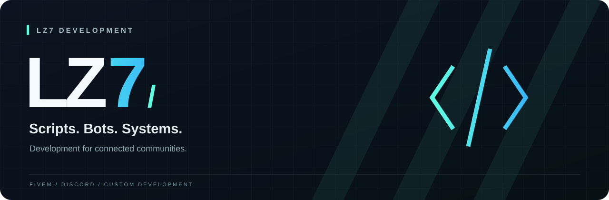

  

  <b>FiveM resources · Discord bots · Custom systems</b> 
  Tools and experiences for gaming communities.

  
  &nbsp;
  

 

## The development space

**LZ7 Development** brings scripts, bots and systems together around one focus: the communities that use them.

<table>
  <tr>
    <td width="33%" valign="top">
      <h3>01 / FiveM</h3>
      
Gameplay resources, server features and in-game interfaces.

      LUA · QBCORE · NUI
    </td>
    <td width="33%" valign="top">
      <h3>02 / Discord</h3>
      
Bots, community tools and workflow automation.

      BOTS · AUTOMATION · INTEGRATIONS
    </td>
    <td width="33%" valign="top">
      <h3>03 / Systems</h3>
      
Custom functionality that connects interfaces and server logic.

      INTERFACES · LOGIC · TOOLING
    </td>
  </tr>
</table>

## Built with purpose

Readable code. Clear configuration. Thoughtful interfaces. 
These are the principles behind the work at LZ7.

## Connect with LZ7

For project discussions and community updates, join us on **[Discord ↗](https://discord.gg/jVTRaGxu48)**.

 

---

<b>LZ7 DEVELOPMENT</b> &nbsp; / &nbsp; Scripts. Bots. Systems.

